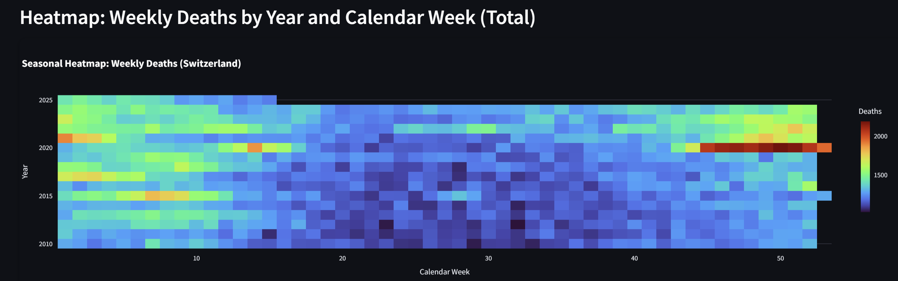

# Swiss Mortality & Population Trends Dashboard

## Declaration

This project was created as an assignment for the Data Visualization course HSLU FS2025.


## Project Overview

This project presents an interactive dashboard for visualizing weekly and yearly mortality data for Switzerland. 
Users can explore trends by age group, gender, and mortality rates, as well as view a seasonal heatmap of weekly deaths. The dashboard is built using Python with Streamlit for the web application, Pandas for data manipulation, and Plotly Express for generating interactive visualizations.


## Screenshots

#### 1. Weekly Deaths by Age Group


#### 2. Absolute Yearly Deaths by Gender


#### 3. Yearly Mortality Rate per 100,000 Inhabitants


#### 4. Heatmap: Weekly Deaths by Year and Calendar Week (Total)



## Features

*   **Interactive Visualizations:** All charts are interactive, allowing users to hover for details.
*   **Dark Theme:** Custom CSS is applied for a modern dark theme and enhanced visual appeal.
*   **Sidebar Controls:**
    *   Date range selectors for weekly data.
    *   Year range selectors for yearly data and the heatmap.
    *   Y-axis range selectors for line charts to allow focused analysis.
*   **Data Caching:** Streamlit's `@st.cache_data` is used to optimize data loading performance.
*   **Responsive Design:** The dashboard layout is set to "wide" for better use of screen real estate.
*   **Robust Data Loading:** Functions include error handling and data cleaning steps for various CSV formats.

## Data Sources

The dashboard utilizes the following datasets:

1.  `data/Weekly_number_of_deaths.csv`: Contains weekly death counts, split into 0-64 and 65+ year olds. Used for Graph 1 and Graph 4.
2.  `data/Deaths_Absolute_number.csv`: Contains absolute yearly death counts, broken down by gender. Used for Graph 2.
3.  `data/Mortality_rate_per_100000_inhabitants.csv`: Contains yearly mortality rates per 100,000 inhabitants, broken down by gender. Used for Graph 3.

## Technologies Used

*   **Python 3.12.8**
*   **Streamlit:** For building the interactive web application.
*   **Pandas:** For data manipulation and analysis.
*   **Plotly Express:** For creating interactive charts and visualizations.
*   **NumPy:** For numerical operations, especially in axis range calculations.
*   **OS & Datetime:** Standard Python libraries for file path management and date/time operations.

## Setup and Installation

1.  **Clone the repository (or download the files):**
    ```bash
    git clone <https://github.com/drunkPotato/MortalityVisualization>
    cd <MortalityVisualization>
    ```


3.  **Install dependencies:**
    Make sure you have a `requirements.txt` file.
    Then install:
    pip install -r requirements.txt
    Alternatively, if you don't have a `requirements.txt`, install the packages directly

4.  **Data Files:**
    Ensure the required CSV data files (`Weekly_number_of_deaths.csv`, `Deaths_Absolute_number.csv`, `Mortality_rate_per_100000_inhabitants.csv`) are placed in a subdirectory named `data/` within the project's root folder.

## Running the Application

1.  Navigate to the project directory in your terminal.
2.  Run the Streamlit application using the following command 
    streamlit run app.py
3.  The application will open in your default web browser.

## Project Structure

```text
MORTALITYVISUALIZATION/
├── app.py            
├── data/
│   ├── Weekly_number_of_deaths.csv
│   ├── Deaths_Absolute_number.csv
│   └── Mortality_rate_per_100000_inhabitants.csv
├── screenshots/
│   ├── Absolute Yearly Deaths by Gender.png
│   ├── heatmap.png
│   ├── Weekly Deaths by Age Group.png
│   └── Yearly Mortality Rate per100,000 Inhabitants.png
├── .gitignore
├── requirements.txt        
├── README.md                 
├── .streamlit/               
└── __pycache__/              
```

## Code Highlights

*   **Modular Data Loading:** Separate functions (`load_weekly_deaths_data`, `load_absolute_deaths_data`, etc.) are used for loading and preprocessing each dataset, promoting reusability and clarity. `@st.cache_data` is applied to these functions to prevent redundant data loading.
*   **Dynamic Axis Controls:** The `get_axis_ranges` helper function dynamically creates sidebar sliders for x and y axes based on the data type (datetime or numeric) and range of the provided columns.
*   **Custom CSS Injection:** `st.markdown(..., unsafe_allow_html=True)` is used to inject custom CSS for a dark theme, rounded corners on plots, and improved typography.
*   **Plotly Dark Template:** `px.defaults.template = "plotly_dark"` ensures all Plotly charts adhere to the dark theme by default.
*   **Data Transformation:** Pandas `melt` function is used effectively to transform data from wide to long format, suitable for plotting with Plotly Express when comparing categories (e.g., 'Men' vs. 'Women').
*   **Error Handling:** Basic error handling (e.g., `FileNotFoundError`, `Exception`) is included in data loading functions.